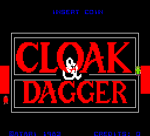
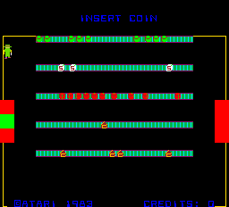
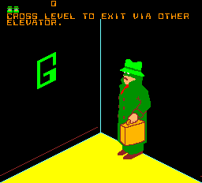
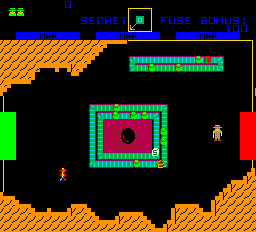

# Cloak & Dagger for MiSTer

## Overview

Working in progress FPGA implementation of **Cloak & Dagger**, originally released by Atari, Inc. in March 1984.

Current status: functional behavioural implementation, mainly based on MAME/reference behaviour.

Long-term goal: progressively improve the core through visual audits of Schematic Sheets and move it closer to a schematic-aligned implementation where possible.

---

## Screenshots

| | |
| --- | --- |
|  |  |
|  |  |

---

## ROM Requirements

ROM files are **not included**.

To use this arcade core, you must provide legally obtained ROM files.

To simplify setup:

- `.mra` files are provided in the **Releases** section.
- The `.mra` specifies all required ROM files along with checksums.
- The ROM `.zip` filename corresponds to the naming convention used by the MAME project.

For setup instructions and environment configuration, refer to:

MiSTer Arcade ROM guide:  
https://github.com/MiSTer-devel/Main_MiSTer/wiki/Arcade-Roms

---

## Installation

1. Copy the core `.rbf` file to your MiSTer `/_Arcade/cores` folder.
2. Copy the '.mra' file to your MiSTer '/_Arcade' folder.
3. Place the appropriate ROM `.zip` files in your `/games/mame` directory.
4. Launch the core from the MiSTer Arcade menu.

---

## Legal Notice

This project contains **no copyrighted game data**.

Users are responsible for obtaining and using ROM files in accordance with applicable laws.

Do not request ROM files in issues or discussions.

---
